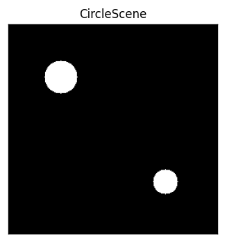
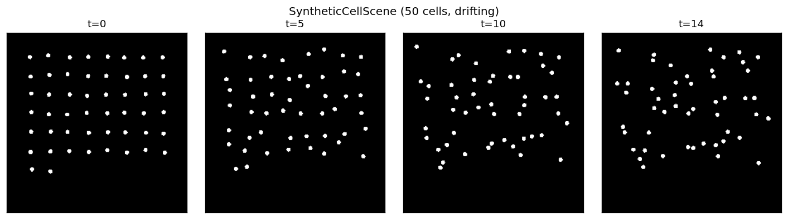
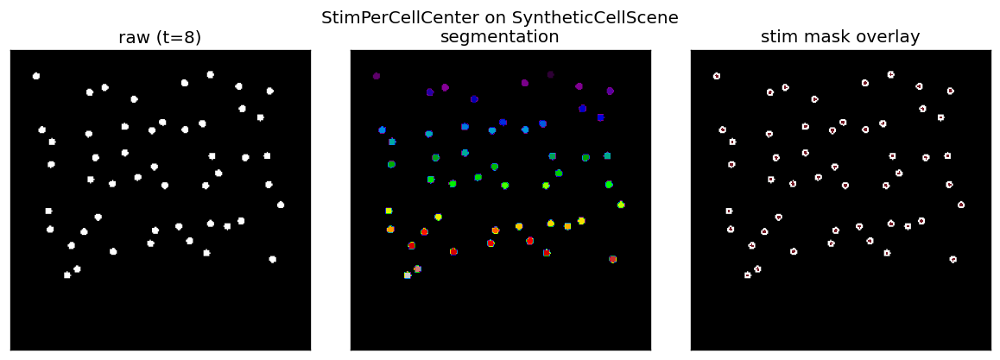

# faro tests

## Running

```bash
pytest                         # full suite, sequential
pytest -n auto                 # parallel (pytest-xdist), ~60s on 10 cores
pytest tests/test_contracts.py # one file
pytest -k "division"           # by name
pytest --scope moench          # also run Pertzlab hardware tests
```

Hardware tests under `tests/hardware/` require a real Pertzlab scope and
are auto-skipped without `--scope <moench|niesen|jungfrau>` (or
`FARO_SCOPE=...`).

## Layout

| File | What it covers |
|------|----------------|
| `test_contracts.py` | API contracts: every Segmentator returns a 2D int array, every Tracker returns a DataFrame with the required columns, etc. Narrow, fast unit tests. |
| `test_pipeline_integration.py` | Happy-path end-to-end + continue/extend/no-cell edge cases. Parametrised across Trackpy/Motile. |
| `test_pipeline_stim.py` | Stim-branch end-to-end: `current`/`previous` mode mask selection, all three stimulator shortcuts (`Stim`/`StimWithImage`/`StimWithPipeline`), stim-mask-timeout. |
| `test_pipeline_failures.py` | Crash handling (each pipeline stage fails), slow-segmentation stress, 100-frame burst. |
| `test_tracking_accuracy.py` | Tracker accuracy on 50 moving cells with ground truth; stim-mask alignment. |
| `test_tracking_divisions.py` | Cell division handling for both trackers. |
| `test_writers.py` | TIFF + OME-Zarr schema: shapes, axis order, plate layout. |
| `test_validate_hardware.py` | Pre-flight `validate_hardware` checks (channel existence, exposure/power limits). |
| `hardware/pertzlab/test_pertzlab_unit.py` | Pertzlab-specific unit tests (power-property detection, `SKIP_WAIT_DEVICES`). Not hardware-gated; uses fakes. |
| `test_event_ordering.py` | `RTMSequence.iter_events` axis-order semantics. |
| `test_events_to_dataframe.py` | Event-list → DataFrame serialization. |
| `test_frame_dispenser.py` | Concurrent put/get primitives used by the pipeline threads. |

Shared helpers live in:

- **`fake_mmc.py`** — `build_core(scene)` spins up a real `UniMMCore`
  wired to pure-Python `FakeCamera` / `FakeSLM` devices. The `Scene`
  protocol is the test's plug-in for frame rendering.
- **`fake_microscope.py`** — `FakeMicroscope(scene)` wraps `build_core`
  in a `PyMMCoreMicroscope` so the Controller sees it as a normal
  microscope.
- **`fixtures.py`** — reusable scenes/builders/helpers:
  `CircleScene`, `make_events`, `make_pipeline`, `run_and_wait`,
  `assert_no_background_errors`, and a parametrised `tracker` fixture
  that cycles over Trackpy and Motile.

`manual_smoke_tracking.py` and `manual_smoke_writers.py` are not
pytest-collected — they're dev scripts that write outputs to disk for
napari inspection.

## What the built-in scenes look like



`CircleScene` (`tests/fixtures.py`): two bright uint16 circles at fixed
positions on a 256×256 black background. Default scene for end-to-end
pipeline tests — the segmenter always finds exactly two labels.



`SyntheticCellScene` (`tests/test_tracking_accuracy.py`): 50 cells
rendered as small disks with deterministic linear drift plus Brownian
noise. Used by the tracking-accuracy suite; known per-frame ground
truth lives on `scene.gt[t]`.



When the pipeline runs with `StimPerCellCenter` stim the scene
captures each dispatched SLM mask in `scene.slm_events`. The mask's
blob centroids should sit on top of the GT cell positions — the
stim-alignment test (`test_stim_masks_centered_on_cells`) asserts that
median offset ≤ 2 px.

Regenerate the images with `python -m tests.assets.generate` after
editing a scene.

## Writing a new test

### Unit test for a new Segmentator / Stim / FE

Put it in `test_contracts.py` alongside the existing parametrised
contract tests. The contract suite will then automatically cover your
implementation.

```python
class TestSegmentationContract:
    @pytest.fixture(params=[..., MyNewSegmentator()], ids=[..., "Mine"])
    def segmentator(self, request):
        return request.param
```

### Tracker-specific output columns

Trackers may add columns beyond the required `particle / x / y / label`
(e.g. `TrackerMotile` adds `parent_particle` for lineage). The pipeline
concats each frame's output and saves to parquet, so extra columns
just propagate. To test that your tracker's extra column behaves:

```python
def test_my_tracker_adds_cost_column(tmp_dir):
    df = _run(tmp_dir, MyTracker())
    assert "cost" in df.columns
    assert (df["cost"] >= 0).all()
```

Contract tests check the *required* columns only (subset match), so
extra columns do not need to be declared in any base class.

### Integration test for a new stimulator

Use `FakeMicroscope` + `CircleScene(with_slm=True)`:

```python
from tests.fake_microscope import FakeMicroscope
from tests.fixtures import (
    CircleScene, make_events, make_pipeline, run_and_wait, tracker,
)


def test_my_stim_fires_on_expected_frames(tmp_dir, tracker):
    scene = CircleScene(with_slm=True)
    mic = FakeMicroscope(scene)
    pipeline = make_pipeline(tmp_dir, tracker=tracker, stimulator=MyStim())
    ctrl = Controller(mic, pipeline)
    events = make_events(5, stim_frames=(2, 3))
    run_and_wait(ctrl, events, stim_mode="current")

    # scene.slm_events holds (frame_idx, ndarray) for every SLM dispatch
    assert [t for t, _ in scene.slm_events] == [2, 3]
```

Skip the `tracker` fixture argument if you don't care which tracker
runs; pass `tracker=TrackerTrackpy(...)` directly to `make_pipeline`.

### Custom scene for your own scenario

A scene is any object with `image_height`, `image_width`, `channels`,
and `render(event)`. Add `slm_name`/`slm_shape` and
`on_slm_displayed(mask, event)` for stim-aware scenes. The whole
protocol is documented in `fake_mmc.py::Scene`.

```python
class MovingBar:
    image_height = image_width = 256
    channels = ("phase-contrast",)

    def render(self, event):
        t = event.index.get("t", 0)
        img = np.zeros((256, 256), dtype=np.uint16)
        img[:, t * 4 : t * 4 + 20] = 50_000
        return img

mic = FakeMicroscope(MovingBar())
```

### Test for pre-flight validation

Use `build_validation_core` when you need a core that reports specific
channels/devices/property limits without running acquisitions:

```python
from tests.fake_mmc import build_validation_core

def test_my_validator_rejects_bogus_channel():
    mmc = build_validation_core(
        config_groups={"Channel": ["DAPI", "GFP"]},
        property_limits={("Camera", "Exposure"): (1.0, 500.0)},
    )
    events = [...]
    assert validate_hardware(events, mmc) is False
```

## Adding a scene with different hardware shape

Scenes are the only place to declare hardware shape. If you need a
genuinely different setup (e.g. **no SLM** and **only one channel**, or
**multiple light-source devices**), build a new scene class — don't
rename things on an existing one. Picking different literal strings
for the channel group is not a meaningful variation.

Examples of real variation worth a separate scene:

- Single-channel brightfield only (no fluorescence, no stim).
- Multichannel fluorescence with a `Spectra` light-source device that
  has `*_Level` power properties (needed to exercise
  `detect_power_properties`).
- DMD-equipped vs. DMD-free (the latter skips the whole stim branch
  in the Controller).

Validation tests already use `build_validation_core(...)` to mix and
match these without writing Scene classes. Acquisition tests should
write Scene classes.

## Conventions

- Class-based `TestXxx` for closely-related tests sharing setup (an
  `@pytest.fixture(autouse=True) setup`). Function-based `def test_x`
  for one-offs.
- `tmp_dir` fixture (defined in `conftest.py`) gives a fresh str path;
  pytest's built-in `tmp_path` is also available if you prefer `Path`.
- Integration tests should import the `tracker` fixture from
  `fixtures.py` to run against both Trackpy and Motile. Skip
  parametrisation only when your test depends on a tracker-specific
  feature (e.g. Motile divisions).
- `assert_no_background_errors(ctrl)` after `run_and_wait` — the
  analyzer swallows worker-thread exceptions by design; this helper
  raises them back up.
